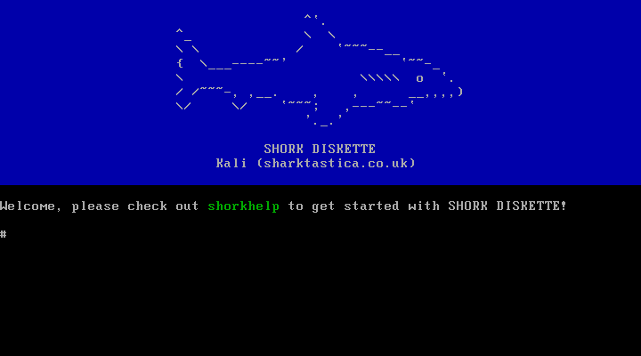

# SHORK DISKETTE

Member of the SHORK family:  [SHORK 486](https://github.com/SharktasticA/SHORK-486) | **SHORK DISKETTE**

-----

SHORK DISKETTE is a diskette-based minimal Linux distribution derived from the disk-based SHORK 486. The aim is to produce an operating system that is very lean but functional for PCs with 486SX-class or better processors, often with my '90s IBM ThinkPads in mind. It was based on [FLOPPINUX's build instructions](https://github.com/w84death/floppinux) and inspired by [Action Retro's demonstration of it](https://www.youtube.com/watch?v=SiHZbnFrHOY), first developed as an automated build script for achieving something similar but can be Dockerised for building on a wider range of systems, then used as the basis for an operating system with additional functionality and tailored to my usage.

SHORK DISKETTE aims to work with at least 16MiB system memory and fit on a single 1.44MB 3.5" floppy diskette. Despite that constraint, SHORK DISKETTE offers a modern Linux kernel from 2025, a selection of typical Linux commands, some custom SHORK utilities, and a cute ASCII shark welcome screen!

## Capabilities

### Core commands (BusyBox)

awk, basename, cat, clear, cp, date, df, expr, free, hostname, less, ln, ls, mkdir, mount, mv, printf, pwd, readlink, rev, rm, rmdir, sed, sync, tee, touch, umount, uname, vi

### Custom utilities 

* **shorkfetch** - Displays basic system and environment information. Similar to fastfetch, neofetch, etc. Takes no arguments.
* **shorkhelp** - Provides help with using SHORK DISKETTE via command lists and guides. Requires one of three parameters:
    * `--commands`: Shows a command list including core commands, utilities, bundled software, and bundled SHORK utilities.
    * `--intro`: Shows an introductory paragraph for SHORK DISKETTE.
    * `--shorkutils`: Shows a list of SHORK utilities with a brief explanation of what they do.

## Hardware requirements

### CPU

An **Intel 486SX** is the minimum processor requirement. Math emulation is enabled, so a 486DX or a separate co-processor is not required (although still supported).

### RAM

**16MiB** is the minimum system memory requirement.

### Graphics

Only a basic **IBM VGA display card or compatible** is required for using SHORK DISKETTE.

## Usage

Please read "Notice & disclaimers" at the end of this readme before proceeding. Building SHORK DISKETTE may require up to 3GiB of disk space.

### Native building

If you are using an Arch or Debian-based Linux, run `build.sh` whilst in the `shork-diskette` directory and answer any prompts given throughout the process. Build parameters are listed in the "Scripts & parameters" section of this readme that can be used to reduce the need for the aforementioned prompts.

### Dockerised building

If you are using Windows, macOS (x86-64), a Linux distribution that has not been tested with native building, or want some kind of "sandbox" around the build process, you can try Dockerised building instead. It will create a Docker container with a minimal Debian 13 installation that is active for just the lifetime of the build process. You simply run `docker-compose up`.

Build parameters as seen in the "Scripts & parameters" section can also be used for Dockerised building, placed in a list under `services` -> `shork-diskette-build` -> `command` inside `docker-compose.yml`. If a build run has already been made, you may need to run `docker-compose up --build` instead before any changes are applied.

### Build process

The following describes the build process as it is by default (no build parameters used).

1. The user is prompted to choose if their host environment is Arch or Debian-based. Packages required for the build process are installed based on the host environment choice.

2. An i486 musl cross-compiler is downloaded and extracted.

3. BusyBox is downloaded and compiled. BusyBox provides SHORK DISKETTE with Unix-style utilities and an init system in one executable. BusyBox's compilation is used as the basis for SHORK DISKETTE's root file system in `build/root`.

4. The Linux kernel is downloaded and compiled. `configs/linux.config` is copied during this process, which provides a minimal configuration tailored to support 486SX, PATA/IDE storage devices and basic networking without any further modification or build parameters. The output is `build/bzImage`.

5. Licences for all bundled software are gathered and copied to the root file system. 

6. Building the root file system is continued. This involves creating all required subdirectories, copying all of `sysfiles` contents and SHORK utilities from `shorkutils` to their relevant places within the root file system. The root file system is compressed into a single file.

7. A raw diskette image (`images/shork-diskette.img`) is created, and the kernel image, compressed root file system and bootloader are installed to it.

8. An after-build report (`images/report.txt`) is generated to help confirm if the build was completed as intended. It confirms the type of build, the time it took to create, the minimum system memory requirement, and which programs or features are included or excluded.

### After building

Once built, a raw diskette image (`shork-diskette.img`) and an after-build report (`report.txt`) should be present in the `images` folder. The raw diskette image can be used as-is with emulation or virtualisation software like 86Box or VMware Workstation, or written to a real diskette using (e.g.) `dd`.

It is recommended to move or copy the images out of this directory before extensive or serious use because they will be replaced if the build process is rerun.

## Scripts & parameters

* `build.sh`: Contains the complete download and compilation process that reproduces a working SHORK DISKETTE system on a raw diskette image.

* `clean.sh`: Deletes anything that was downloaded, created or generated by `build.sh`.

### Build parameters

#### Build automation

These parameters help automate the use of the build script, especially for successive runs. Note that some of these should be used wisely! The "skip kernel" and "skip BusyBox" parameters are useful for speeding up successive builds that differ only by their sysfiles, but any changes to their respective `.config` files or any manual patches made in the build script will not be applied and "stale" compilations will be used.

* **Always (re)build** (`--always-build`): can be used to ensure the kernel is always (re)built. This will skip the prompt that appears if the kernel is already downloaded and built, acting like the user selected the "Reset & clean" option.
    * This does nothing if the "skip kernel" parameter is also used.

* **Is Arch** (`--is-arch`): can be used skip the host Linux distribution selection prompt and the build script will assume it is running on an Arch-based system.

* **Is Debian** (`--is-debian`): can be used skip the host Linux distribution selection prompt and the build script will assume it is running on a Debian-based system.

* **Skip kernel** (`--skip-kernel`): can be used to skip recompiling the kernel.
    * This parameter requires at least one complete build.
    * This does nothing if the "minimal" Aparameter is also used.

* **Skip BusyBox** (`--skip-busybox`): can be used to skip recompiling BusyBox.
    * This parameter requires at least one complete build.
    * This does nothing if the "minimal" parameter is also used.

#### Fixes

* **Fix SYSLINUX** (`--fix-syslinux`): can be used to force using my forked SYSLINUX repository instead of the host Linux distro's maintained packaged version. This version addresses a memory detection error to resolve the "Booting kernel failed: Invalid argument" or boot menu looping issue that the stock SYSLINUX may encounter when attempting to boot the kernel.
    * Some people need this, some people do not - see the list below, or try without first, then enable this if this error or something like it occurs.
    * Known hardware that need this include: Chicony NB5 ([derivatives]((www.macdat.net/laptops/chicony/nb5.php))), IBM 2625 ThinkPad 365E/ED, IBM 6381 PS/ValuePoint
        * If you discover more hardware that needs this, please get in touch so I can update this list for future users!
    * This may significantly increase total build time.
    * The patch was discovered by akeym - thank you!

## Directories

* `build`: Contains the source code repositories, the root file system and the kernel image downloaded or made by the build process.
    * Created after a build attempt is made.
    * Do not directly modify or add files to this directory, as the directory may be deleted and recreated upon running the build script again.

* `configs`: Contains configuration files used when compiling certain software, most notably SHORK DISKETTE's tailored Linux kernel and BusyBox `.config` files.

* `images`: Contains the result raw diskette image and an after-build report created by the build process.
    * Created after a build attempt is made.

* `shorkutils`: Contains custom SHORK utilities to be copied to the root file system before zipping 

* `sysfiles`: Contains important system files to be copied into the root file system before zipping.

## Notice & disclaimers

Running `build.sh` for native compilation will automatically perform several tasks on the host computer and operating system, installing prerequisite packages, modifying PATH, and creating some environment variables. If you intend to use this yourself, please note that this is tailored for my personal usage. Please review what the script does to ensure it does not conflict with your existing configuration. Alternatively, consider Dockerised compilation to minimise impact to your host operating system.

Running `clean.sh` will delete everything `build.sh` has downloaded, created or generated, including the `build` folder and its contents. `.gitingore` indicates what would be deleted. If you made any manual changes to or in a file or directory covered by that, they will be lost.

At present, you are always the root user when using SHORK DISKETTE. Make sure to act and use it considerately and responsibly.
